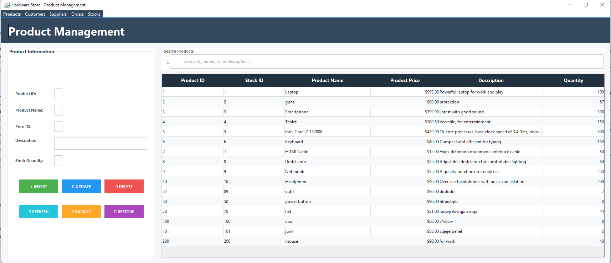

# Hardware Store Database Management System

A comprehensive Java Swing-based desktop application for managing a hardware store's inventory, customers, orders, suppliers, and stock records.


## 📋 Table of Contents

- [Features](#features)
- [Prerequisites](#prerequisites)
- [MySQL Database Setup](#mysql-database-setup)
- [Installation](#installation)
- [Running the Application](#running-the-application)
- [Database Schema](#database-schema)
- [Screenshots](#screenshots)
- [Project Structure](#project-structure)
- [Troubleshooting](#troubleshooting)

## ✨ Features

- **Product Management**: Add, update, delete, and search products with descriptions and pricing
- **Customer Management**: Manage customer information including name, email, and phone
- **Order Management**: Track orders with customer IDs, dates, and total costs
- **Stock Management**: Monitor stock levels and quantities
- **Supplier Management**: Maintain supplier contact information and relationships
- **Modern UI/UX**: Clean, professional interface with:
  - Card-based input panels
  - Real-time search functionality
  - Input validation with visual feedback
  - Empty state messages
  - Responsive table layouts
  - Color-coded action buttons

## 📦 Prerequisites

Before you begin, ensure you have the following installed:

- **Java Development Kit (JDK) 17** or higher
  - Download from: [Oracle JDK](https://www.oracle.com/java/technologies/downloads/) or [OpenJDK](https://openjdk.org/)
  - Verify installation: `java -version`

- **MySQL Server 8.0** or higher
  - Download from: [MySQL Downloads](https://dev.mysql.com/downloads/mysql/)
  - Verify installation: `mysql --version`

- **MySQL Workbench** (Optional but recommended)
  - Download from: [MySQL Workbench](https://dev.mysql.com/downloads/workbench/)

- **PowerShell** (Windows) or **Terminal** (Linux/Mac)

## 🗄️ MySQL Database Setup

### Step 1: Install MySQL Server

1. Download MySQL Server from the [official website](https://dev.mysql.com/downloads/mysql/)
2. Run the installer and follow the setup wizard
3. **Important**: During installation, set the root password to: `12345678`
   - If you prefer a different password, you'll need to update the connection credentials in the Java source files

### Step 2: Start MySQL Service

**Windows:**
```powershell
# Check if MySQL service is running
Get-Service MySQL*

# Start MySQL service (if not running)
Start-Service MySQL80
```

**Linux/Mac:**
```bash
# Check MySQL status
sudo systemctl status mysql

# Start MySQL (if not running)
sudo systemctl start mysql
```

### Step 3: Create the Database

Open MySQL Command Line Client or MySQL Workbench and run:

```sql
-- Connect to MySQL as root
mysql -u root -p
-- Enter password: 12345678

-- Create the database
CREATE DATABASE IF NOT EXISTS hardwaredb;

-- Use the database
USE hardwaredb;
```

### Step 4: Create Tables

Run the following SQL script to create all required tables:

```sql
-- Product Table
CREATE TABLE IF NOT EXISTS product (
    product_id INT PRIMARY KEY,
    stock_id INT NOT NULL,
    product_name VARCHAR(255) NOT NULL,
    description TEXT,
    price DECIMAL(10, 2) NOT NULL,
    stock_quantity INT NOT NULL,
    INDEX idx_stock_id (stock_id)
);

-- Customer Table
CREATE TABLE IF NOT EXISTS customer (
    customer_id INT AUTO_INCREMENT PRIMARY KEY,
    customer_name VARCHAR(255) NOT NULL,
    email VARCHAR(255) NOT NULL,
    phone VARCHAR(20) NOT NULL,
    INDEX idx_email (email)
);

-- Orders Table
CREATE TABLE IF NOT EXISTS orders (
    order_id INT AUTO_INCREMENT PRIMARY KEY,
    cus_id INT NOT NULL,
    date DATE NOT NULL,
    total_cost DECIMAL(10, 2) NOT NULL,
    FOREIGN KEY (cus_id) REFERENCES customer(customer_id) ON DELETE CASCADE,
    INDEX idx_cus_id (cus_id),
    INDEX idx_date (date)
);

-- Stock Table
CREATE TABLE IF NOT EXISTS stock (
    stock_id INT PRIMARY KEY,
    product_id INT NOT NULL,
    quantity INT NOT NULL,
    FOREIGN KEY (product_id) REFERENCES product(product_id) ON DELETE CASCADE,
    INDEX idx_product_id (product_id)
);

-- Supplier Table
CREATE TABLE IF NOT EXISTS supplier (
    supplier_id INT AUTO_INCREMENT PRIMARY KEY,
    supplier_name VARCHAR(255) NOT NULL,
    supplier_email VARCHAR(255) NOT NULL,
    supplier_phone VARCHAR(20) NOT NULL,
    supplier_address TEXT,
    stock_id INT NOT NULL,
    FOREIGN KEY (stock_id) REFERENCES stock(stock_id) ON DELETE CASCADE,
    INDEX idx_stock_id (stock_id)
);
```

### Step 5: Verify Database Connection

Test the connection using MySQL Workbench or command line:

```sql
-- Verify database exists
SHOW DATABASES;

-- Verify tables are created
USE hardwaredb;
SHOW TABLES;

-- Expected output:
-- customer
-- orders
-- product
-- stock
-- supplier
```

### Step 6: (Optional) Insert Sample Data

You can insert sample data to test the application:

```sql
USE hardwaredb;

-- Insert sample stock
INSERT INTO stock (stock_id, product_id, quantity) VALUES
(1, 1, 100),
(2, 2, 50),
(3, 3, 75);

-- Insert sample products
INSERT INTO product (product_id, stock_id, product_name, description, price, stock_quantity) VALUES
(1, 1, 'Hammer', 'Heavy-duty construction hammer', 25.99, 100),
(2, 2, 'Screwdriver Set', '10-piece screwdriver set', 19.99, 50),
(3, 3, 'Power Drill', 'Cordless power drill with battery', 89.99, 75);

-- Insert sample customers
INSERT INTO customer (customer_name, email, phone) VALUES
('John Doe', 'john.doe@email.com', '555-0101'),
('Jane Smith', 'jane.smith@email.com', '555-0102'),
('Bob Johnson', 'bob.johnson@email.com', '555-0103');

-- Insert sample suppliers
INSERT INTO supplier (supplier_name, supplier_email, supplier_phone, supplier_address, stock_id) VALUES
('Tool Supply Co', 'contact@toolsupply.com', '555-1001', '123 Industrial Ave, City, State 12345', 1),
('Hardware Distributors', 'info@hardwaredist.com', '555-1002', '456 Commerce St, City, State 12345', 2);
```

## 🚀 Installation

### Clone or Download the Project

```bash
# If using Git
git clone <repository-url>
cd Hardware-store-DBMS/HardwareStoreDBMS

# Or download and extract the ZIP file
```

### Configure Database Credentials

1. **Create `.env` file** in the `HardwareStoreDBMS` directory:
   
   **Windows PowerShell:**
   ```powershell
   Copy-Item .env.example .env
   ```
   
   **Linux/Mac:**
   ```bash
   cp .env.example .env
   ```

2. **Edit `.env`** with your MySQL credentials:
   ```env
   DB_HOST=localhost
   DB_PORT=3306
   DB_NAME=hardwaredb
   DB_USER=root
   DB_PASSWORD=your_password_here
   ```

   > **Note**: If `.env` file doesn't exist, the application will use default values (password: `12345678`). However, it's recommended to create the `.env` file for security.

### Download MySQL Connector

The MySQL connector JAR is automatically downloaded by the `run-ui.ps1` script. If you need to download it manually:

1. Download from: [MySQL Connector/J 8.0.33](https://repo1.maven.org/maven2/mysql/mysql-connector-java/8.0.33/mysql-connector-java-8.0.33.jar)
2. Place it in: `HardwareStoreDBMS/lib/mysql-connector-j-8.0.33.jar`

## 🏃 Running the Application

### Method 1: Using PowerShell Script (Recommended for Windows)

Navigate to the `HardwareStoreDBMS` directory and run:

```powershell
# Run Product Management UI
.\run-ui.ps1 ProductF

# Run Customer Management UI
.\run-ui.ps1 CustomerF

# Run Order Management UI
.\run-ui.ps1 OrderF

# Run Stock Management UI
.\run-ui.ps1 StockF

# Run Supplier Management UI
.\run-ui.ps1 SupplierF
```

The script will automatically:
- Compile the Java files
- Download MySQL connector if missing
- Set up the classpath
- Launch the selected GUI

### Method 2: Using Maven (If Installed)

```bash
# Compile the project
mvn compile

# Run Product UI
mvn exec:java -Dexec.mainClass="com.mycompany.hardwarestoredbms.GUI.ProductF"

# Run Customer UI
mvn exec:java -Dexec.mainClass="com.mycompany.hardwarestoredbms.GUI.CustomerF"

# Run Order UI
mvn exec:java -Dexec.mainClass="com.mycompany.hardwarestoredbms.GUI.OrderF"

# Run Stock UI
mvn exec:java -Dexec.mainClass="com.mycompany.hardwarestoredbms.GUI.StockF"

# Run Supplier UI
mvn exec:java -Dexec.mainClass="com.mycompany.hardwarestoredbms.GUI.SupplierF"
```

### Method 3: Using IDE (IntelliJ IDEA, Eclipse, NetBeans)

1. Open the project in your IDE
2. Right-click on any GUI file (e.g., `ProductF.java`)
3. Select "Run" or "Run File"
4. The IDE will handle compilation and classpath automatically

### Method 4: Manual Java Command

```bash
# Compile first
javac -cp "lib/mysql-connector-j-8.0.33.jar" -d target/classes src/main/java/com/mycompany/hardwarestoredbms/GUI/*.java src/main/java/com/mycompany/hardwarestoredbms/*.java

# Run
java -cp "target/classes;lib/mysql-connector-j-8.0.33.jar" com.mycompany.hardwarestoredbms.GUI.ProductF
```

## 📊 Database Schema

### Entity Relationship Diagram

```
┌─────────────┐         ┌─────────────┐         ┌─────────────┐
│  Customer   │         │    Order    │         │   Product   │
├─────────────┤         ├─────────────┤         ├─────────────┤
│ customer_id │◄────────│ cus_id      │         │ product_id  │
│ name        │         │ order_id    │         │ stock_id    │
│ email       │         │ date        │         │ name        │
│ phone       │         │ total_cost  │         │ description │
└─────────────┘         └─────────────┘         │ price       │
                                                │ quantity    │
┌─────────────┐         ┌─────────────┐         └─────────────┘
│  Supplier   │         │    Stock    │                │
├─────────────┤         ├─────────────┤                │
│ supplier_id │         │ stock_id    │                │
│ name        │         │ product_id  │◄───────────────┘
│ email       │         │ quantity    │
│ phone       │         └─────────────┘
│ address     │                ▲
│ stock_id    │────────────────┘
└─────────────┘
```

### Table Details

#### Product Table
| Column | Type | Constraints |
|--------|------|-------------|
| product_id | INT | PRIMARY KEY |
| stock_id | INT | NOT NULL |
| product_name | VARCHAR(255) | NOT NULL |
| description | TEXT | |
| price | DECIMAL(10,2) | NOT NULL |
| stock_quantity | INT | NOT NULL |

#### Customer Table
| Column | Type | Constraints |
|--------|------|-------------|
| customer_id | INT | PRIMARY KEY, AUTO_INCREMENT |
| customer_name | VARCHAR(255) | NOT NULL |
| email | VARCHAR(255) | NOT NULL |
| phone | VARCHAR(20) | NOT NULL |

#### Orders Table
| Column | Type | Constraints |
|--------|------|-------------|
| order_id | INT | PRIMARY KEY, AUTO_INCREMENT |
| cus_id | INT | NOT NULL, FOREIGN KEY → customer |
| date | DATE | NOT NULL |
| total_cost | DECIMAL(10,2) | NOT NULL |

#### Stock Table
| Column | Type | Constraints |
|--------|------|-------------|
| stock_id | INT | PRIMARY KEY |
| product_id | INT | NOT NULL, FOREIGN KEY → product |
| quantity | INT | NOT NULL |

#### Supplier Table
| Column | Type | Constraints |
|--------|------|-------------|
| supplier_id | INT | PRIMARY KEY, AUTO_INCREMENT |
| supplier_name | VARCHAR(255) | NOT NULL |
| supplier_email | VARCHAR(255) | NOT NULL |
| supplier_phone | VARCHAR(20) | NOT NULL |
| supplier_address | TEXT | |
| stock_id | INT | NOT NULL, FOREIGN KEY → stock |

## 📸 Screenshots

### Application Interface Preview

#### Product Management Interface

*Modern card-based layout with search functionality and real-time validation*

> **Note**: other menues look similar.


## 📁 Project Structure

```
HardwareStoreDBMS/
│
├── src/
│   └── main/
│       └── java/
│           └── com/
│               └── mycompany/
│                   └── hardwarestoredbms/
│                       ├── GUI/
│                       │   ├── ProductF.java      # Product Management UI
│                       │   ├── CustomerF.java     # Customer Management UI
│                       │   ├── OrderF.java        # Order Management UI
│                       │   ├── StockF.java        # Stock Management UI
│                       │   └── SupplierF.java     # Supplier Management UI
│                       ├── Product.java           # Product business logic
│                       ├── Customer.java           # Customer business logic
│                       ├── Order.java              # Order business logic
│                       ├── Stock.java              # Stock business logic
│                       ├── Supplier.java           # Supplier business logic
│                       └── HardwareStoreDBMS.java  # Main console application
│
├── lib/
│   └── mysql-connector-j-8.0.33.jar    # MySQL JDBC Driver
│
├── preview/                             # Screenshots folder
│   └── product-management.png.png
│
├── target/                              # Compiled classes
│   └── classes/
│
├── pom.xml                             # Maven configuration
├── run-ui.ps1                          # PowerShell script to run UI
└── README.md                           # This file
```

## 🔧 Configuration

### Database Connection Settings

The application uses a `.env` file for database configuration, eliminating hardcoded credentials.

#### Setting Up .env File

1. **Copy the example file:**
   ```bash
   # On Windows PowerShell
   Copy-Item .env.example .env
   
   # On Linux/Mac
   cp .env.example .env
   ```

2. **Edit `.env` file** with your database credentials:
   ```env
   DB_HOST=localhost
   DB_PORT=3306
   DB_NAME=hardwaredb
   DB_USER=root
   DB_PASSWORD=your_password_here
   ```

3. **The `.env` file is automatically ignored by Git** (via `.gitignore`) to protect your credentials.

#### Default Configuration

If `.env` file is not found, the application will use these defaults:

- **Host**: `localhost`
- **Port**: `3306`
- **Database**: `hardwaredb`
- **Username**: `root`
- **Password**: `12345678`

#### How It Works

The `Config.java` utility class automatically:
- Loads configuration from `.env` file on first access
- Searches for `.env` in multiple locations (current directory, project root, etc.)
- Falls back to default values if `.env` is not found
- Provides secure access to database credentials without hardcoding

**No code changes needed** - all database connection methods automatically use the `.env` configuration.

## 🐛 Troubleshooting

### Common Issues and Solutions

#### 1. "No suitable driver found for jdbc:mysql://..."
**Problem**: MySQL connector JAR is missing from classpath.

**Solution**: 
- Ensure `lib/mysql-connector-j-8.0.33.jar` exists
- If missing, run `.\run-ui.ps1` which will download it automatically
- Or download manually from: https://repo1.maven.org/maven2/mysql/mysql-connector-java/8.0.33/

#### 2. "Access denied for user 'root'@'localhost'"
**Problem**: Incorrect MySQL credentials.

**Solution**:
- Verify MySQL root password is `12345678`
- Or update credentials in all Java connection methods
- Test connection using MySQL Workbench first

#### 3. "Unknown database 'hardwaredb'"
**Problem**: Database doesn't exist.

**Solution**:
- Run the SQL script in Step 4 of MySQL Setup to create the database
- Verify with: `SHOW DATABASES;` in MySQL

#### 4. "Table doesn't exist"
**Problem**: Tables not created.

**Solution**:
- Run the CREATE TABLE statements from Step 4
- Verify with: `SHOW TABLES;` in MySQL

#### 5. "Connection refused"
**Problem**: MySQL service not running.

**Solution**:
**Windows:**
```powershell
Start-Service MySQL80
```

**Linux/Mac:**
```bash
sudo systemctl start mysql
```

#### 6. Compilation Errors
**Problem**: Java version mismatch or missing dependencies.

**Solution**:
- Ensure JDK 17+ is installed: `java -version`
- Check JAVA_HOME environment variable
- Clean and rebuild: Delete `target/` folder and recompile

#### 7. GUI Not Displaying
**Problem**: Display issues or missing components.

**Solution**:
- Ensure all Java files are compiled
- Check for error messages in console
- Try running from IDE instead of command line

## 📝 Notes

- The application uses **Java Swing** for the GUI framework
- All database operations use **PreparedStatement** for security (SQL injection prevention)
- The UI includes modern enhancements: search, validation, empty states, and improved styling
- Backup and restore functionality is available for each entity type
- Foreign key constraints ensure data integrity


## 📞 Support

For issues or questions:
1. Check the Troubleshooting section above
2. Review MySQL logs: `C:\ProgramData\MySQL\MySQL Server 8.0\Data\` (Windows)
3. Check Java console output for detailed error messages

---

**Last Updated**: Jan 1 2026
**Version**: 1.0
**Java Version**: 17+
**MySQL Version**: 8.0+
